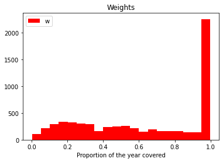

InsuranceAI
================

<!-- WARNING: THIS FILE WAS AUTOGENERATED! DO NOT EDIT! -->

<div>


</div>

<div class="border">

This content can be styled with a border

</div>

We read the data and we convert the variables to their correct types:

## selecting variables

We will work with a subset of the variables. Our endogeneous variables
will be `Comprehensive coverage` for the choice of contract $y_1$ and
`Not at fault` for the occurrence of a claim at fault $y_2$. We also use
the variable `Duration` to weight the observations, and 9 categorical
covariates.

``` python
X.describe()
```

<div>
<style scoped>
    .dataframe tbody tr th:only-of-type {
        vertical-align: middle;
    }

    .dataframe tbody tr th {
        vertical-align: top;
    }

    .dataframe thead th {
        text-align: right;
    }
</style>
<table border="1" class="dataframe">
  <thead>
    <tr style="text-align: right;">
      <th></th>
      <th>Group</th>
      <th>Male</th>
      <th>Occupation</th>
      <th>Region</th>
      <th>Renault</th>
      <th>Age category car</th>
      <th>Age category insuree</th>
      <th>Car use</th>
      <th>Zone</th>
    </tr>
  </thead>
  <tbody>
    <tr>
      <th>count</th>
      <td>6333</td>
      <td>6333</td>
      <td>6333</td>
      <td>6333</td>
      <td>6333</td>
      <td>6333</td>
      <td>6333</td>
      <td>6333</td>
      <td>6333</td>
    </tr>
    <tr>
      <th>unique</th>
      <td>6</td>
      <td>2</td>
      <td>8</td>
      <td>10</td>
      <td>2</td>
      <td>12</td>
      <td>9</td>
      <td>4</td>
      <td>5</td>
    </tr>
    <tr>
      <th>top</th>
      <td>3</td>
      <td>1</td>
      <td>2</td>
      <td>5</td>
      <td>0</td>
      <td>11</td>
      <td>1</td>
      <td>2</td>
      <td>6</td>
    </tr>
    <tr>
      <th>freq</th>
      <td>1272</td>
      <td>3971</td>
      <td>2865</td>
      <td>1019</td>
      <td>5046</td>
      <td>1100</td>
      <td>1354</td>
      <td>2876</td>
      <td>2626</td>
    </tr>
  </tbody>
</table>
</div>

``` python
lhs_vars = pd.DataFrame({
    'Comprehensive coverage': y1, 
    'Claim at fault': y2, 'Duration': w
})
lhs_vars.describe()
```

<div>
<style scoped>
    .dataframe tbody tr th:only-of-type {
        vertical-align: middle;
    }

    .dataframe tbody tr th {
        vertical-align: top;
    }

    .dataframe thead th {
        text-align: right;
    }
</style>
<table border="1" class="dataframe">
  <thead>
    <tr style="text-align: right;">
      <th></th>
      <th>Comprehensive coverage</th>
      <th>Claim at fault</th>
      <th>Duration</th>
    </tr>
  </thead>
  <tbody>
    <tr>
      <th>count</th>
      <td>6333.000000</td>
      <td>6333.000000</td>
      <td>6333.000000</td>
    </tr>
    <tr>
      <th>mean</th>
      <td>0.368704</td>
      <td>0.068530</td>
      <td>0.630466</td>
    </tr>
    <tr>
      <th>std</th>
      <td>0.482491</td>
      <td>0.252673</td>
      <td>0.338334</td>
    </tr>
    <tr>
      <th>min</th>
      <td>0.000000</td>
      <td>0.000000</td>
      <td>0.002740</td>
    </tr>
    <tr>
      <th>25%</th>
      <td>0.000000</td>
      <td>0.000000</td>
      <td>0.304110</td>
    </tr>
    <tr>
      <th>50%</th>
      <td>0.000000</td>
      <td>0.000000</td>
      <td>0.657534</td>
    </tr>
    <tr>
      <th>75%</th>
      <td>1.000000</td>
      <td>0.000000</td>
      <td>0.997260</td>
    </tr>
    <tr>
      <th>max</th>
      <td>1.000000</td>
      <td>1.000000</td>
      <td>0.997260</td>
    </tr>
  </tbody>
</table>
</div>

The matrix of $(y_1,y_2)$ is as follows:

``` python
pd.crosstab(lhs_vars['Comprehensive coverage'], lhs_vars['Claim at fault'])
```

<div>
<style scoped>
    .dataframe tbody tr th:only-of-type {
        vertical-align: middle;
    }

    .dataframe tbody tr th {
        vertical-align: top;
    }

    .dataframe thead th {
        text-align: right;
    }
</style>
<table border="1" class="dataframe">
  <thead>
    <tr style="text-align: right;">
      <th>Claim at fault</th>
      <th>0</th>
      <th>1</th>
    </tr>
    <tr>
      <th>Comprehensive coverage</th>
      <th></th>
      <th></th>
    </tr>
  </thead>
  <tbody>
    <tr>
      <th>0</th>
      <td>3696</td>
      <td>302</td>
    </tr>
    <tr>
      <th>1</th>
      <td>2203</td>
      <td>132</td>
    </tr>
  </tbody>
</table>
</div>

``` python
fig, ax = plt.subplots()
ax.hist(w, color='red', label='w', bins=20)
ax.set(xlabel="Proportion of the year covered", title="Weights")
ax.legend()
plt.show()
```



## first neural network

We fit a simple neural network to $y_1$, tentatively:

``` python
model = keras.Sequential([
    layers.Dense(1, activation="sigmoid", input_dim=9),
])
model.compile(optimizer="rmsprop",
              loss="binary_crossentropy",
              metrics=["accuracy"])
model.fit(X.values[:3200,:], y1.values[:3200],epochs=5, batch_size=128)
```

    Epoch 1/5
    25/25 [==============================] - 0s 441us/step - loss: 5.2681 - accuracy: 0.3491
    Epoch 2/5
    25/25 [==============================] - 0s 400us/step - loss: 4.7489 - accuracy: 0.3444
    Epoch 3/5
     1/25 [>.............................] - ETA: 0s - loss: 4.8325 - accuracy: 0.3047

    2022-11-13 18:52:45.935433: W tensorflow/core/platform/profile_utils/cpu_utils.cc:128] Failed to get CPU frequency: 0 Hz

    25/25 [==============================] - 0s 409us/step - loss: 4.2860 - accuracy: 0.3356
    Epoch 4/5
    25/25 [==============================] - 0s 399us/step - loss: 3.8419 - accuracy: 0.3203
    Epoch 5/5
    25/25 [==============================] - 0s 405us/step - loss: 3.4149 - accuracy: 0.2997

    <keras.callbacks.History>
